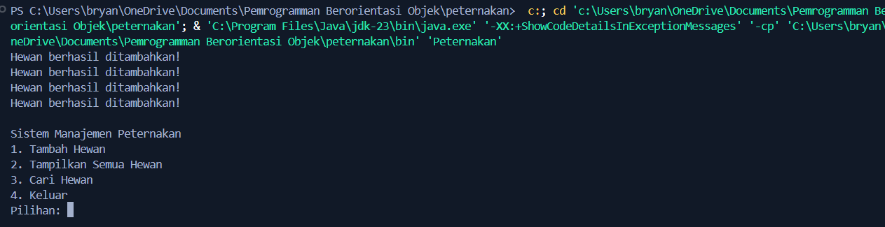

# Sistem Manajemen Peternakan 🐄🐔

**Nama:** Bryan Alberta Hildan Pradana  
**Kelas:** 4ITA1  
**NIM:** 223140148  
**Mata Kuliah:** Pemrograman Berorientasi Objek (PBO)

---

## 📌 Deskripsi

Program ini dibuat untuk memenuhi tugas Ujian Tengah Semester (UTS) mata kuliah **Pemrograman Berorientasi Objek**. Studi kasus yang digunakan adalah *Sistem Manajemen Peternakan*, dengan penerapan prinsip-prinsip OOP seperti:

- ✅ Class & Object  
- ✅ Encapsulation  
- ✅ Inheritance (hingga 2 tingkat)  
- ✅ Polymorphism (method overriding)  
- ✅ Array untuk menyimpan objek

---

## 🧱 Struktur Kelas

Hewan (superclass)
├── Sapi
│ └── SapiPerah
└── Ayam
└── AyamPedaging

## Fitur Program
- Menyimpan data hewan ternak seperti sapi perah dan ayam petelur.
- Menampilkan informasi hewan beserta suara khasnya.
- Menggunakan pewarisan hingga dua tingkat.
- Menunjukkan konsep polymorphism saat iterasi array objek.

## Cara Menjalankan Program
1. Pastikan semua file `.java` sudah disimpan dalam satu folder:
   - `Hewan.java`
   - `Sapi.java`
   - `SapiPerah.java`
   - `Ayam.java`
   - `AyamPetelur.java`
   - `Peternakan.java`

2. Kompilasi semua file:
   ```bash
   javac *.java
   # Sistem Manajemen Peternakan OOP

Program ini mengimplementasikan konsep OOP Java untuk sistem manajemen peternakan.

## Konsep OOP yang Digunakan:
1. **Class & Object**: 
   - Class: Hewan, Ayam, Sapi, Peternakan
   - Object: Instance dari class-class tersebut

2. **Encapsulation**:
   - Attribute seperti nama, umur dibuat private
   - Akses via getter/setter method

3. **Inheritance**:
   - Ayam dan Sapi mewarisi dari Hewan (level 1)
   - AyamPedaging dan AyamPetelur mewarisi dari Ayam (level 2)

4. **Array/Collection**:
   - Menggunakan ArrayList untuk menyimpan data hewan

## Screenshot Output

